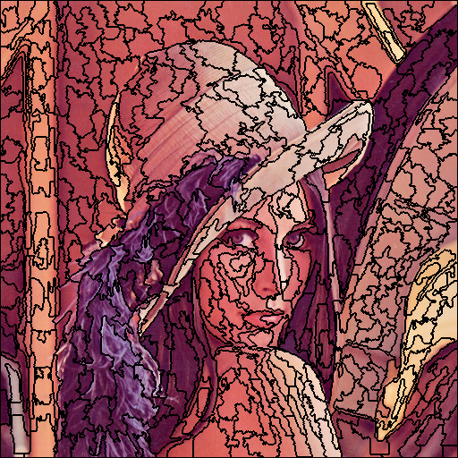
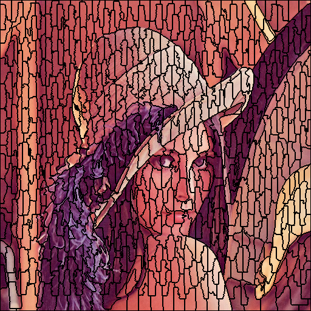

# SLIC论文阅读报告

## 论文综述（实验原理）

在图像分割中，超像素是由一系列相似特征(如颜色，位置，亮度)等相似特征的像素点组成的小区域。每个像素点保留了该区域总体特征，便于后续图像分割处理。

在 “SLIC Superpixels Compared to State-of-the-Art Superpixel Methods” 论文中，提出了一种获取超像素的方法。通过结合像素点的位置和颜色信息对像素点进行聚类，并用类中心值作为超像素的值。在聚类过程中，限制了聚类时搜索的范围，使得聚类收敛速度加快。在我看来就是利用了图像信息的局部性，在加速了程序运行速度的同时，又能得到不错的结果。

## 算法流程（实验步骤）

实现大致分为三个部分：

1. 超像素初始化
2. 聚类迭代
3. 绘制超像素图像

算法实现难度不高，但需要注意许多细节。

## 实现细节（实验步骤）

### 超像素初始化

#### 色彩空间的转换

论文中，对于颜色特征的计算并非在rgb空间中，而是在CIELAB空间中，这就需要对图像的色彩进行转换，先将rgb转到xyz空间，再转到Lab空间。

#### 超像素中心点选取

首先根据超像素数量得到超像素区域为正方形时的面积，得到步长。按照步长均匀放置种子点，在每个种子点的8领域内，计算颜色梯度，取最小梯度的点，作为聚类中心，这避免了聚类中心点落在了边缘上。

### 聚类迭代

#### 聚类计算区域

在聚类的过程中，与传统的 k-means 聚类不同，SLIC只对类中心边长为2S的正方形范围的点计算距离进行类的更新。这是算法速度快的关键原因。

#### 距离计算

在计算像素点到类中心的距离时，论文结合了颜色和空间特征，进行加权计算，公式为：

$$D = \sqrt{(\frac{d_c}{N_c})^2+(\frac{d_s}{N_s})^2}$$

其中

$$ 
\begin{aligned}
    d_c &= \sqrt{(l_i-l_j)^2+(a_i-a_j)^2+(b_i-b_j)^2}\\\\
    d_s &=\sqrt{(x_i-x_j)^2+(y_i-y_j)^2}\\\\
    N_c &= m\\\\
    N_s &= \sqrt{\frac{N}{K}}\\\\
\end{aligned}
$$

$d_c$ 为颜色欧式距离，$d_s$为空间欧式距离，$N_c$ 为一个参数m，$N_s$ 为理想超像素边长,$N$为图像像素数量，$K$为指定的超像素数量。

在实际计算中，因为只是比较大小，为了加快计算，使用如下公式计算距离：

$$D = \sqrt{(d_c^2+(\frac{d_s}{N_s})^2N_c^2}$$

### 绘制超像素图像

#### 合并小像素区域

因为在计算距离的时候结合了颜色特征，所以聚类出来的超像素可能并不连续，需要合并小区域像素。对于判定小区域像素，论文中判定方式为如果像素区域小于S/2，则为小区域像素，需要与周围四领域内的超像素进行合并。

## 实验结果和分析

在超像素数量为700的条件下，改变参数m，分割的超像素结果如下：

m=1:

m=20:

m=40:

总体来看程序根据图像的边缘将图像分为不同的超像素。

随着 m 值变大，空间特征的影响距离的程度越来越大，分割出来的超像素越来越规则，而 m 小时，则超像素则越靠近图像的边界，但是形状越不规则。

平均运行时间为2s左右，可以看出，SLIC是一个有效的超像素算法。

